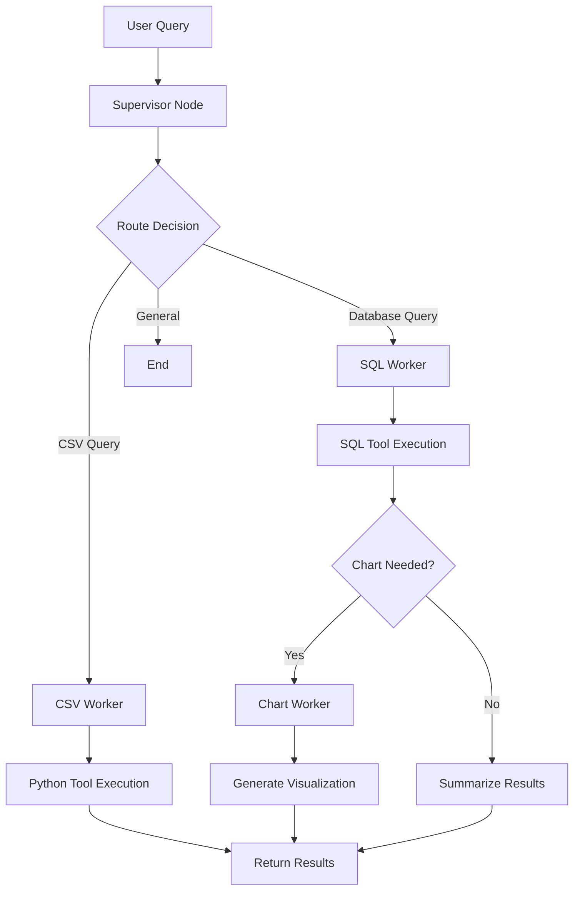

# 📊 Multi-Source AI Agent - CSV & Database Analysis with Visualizations

An intelligent multi-agent system built with LangChain and LangGraph that allows users to interact with CSV files and SQL databases through natural language queries. The agent automatically generates Python code, executes SQL queries, and creates data visualizations based on user requests.


## ✨ Features

### 🤖 Multi-Agent Architecture
- **Supervisor Node**: Intelligently routes queries to appropriate workers
- **CSV Worker**: Analyzes CSV files using Python/pandas
- **SQL Worker**: Queries SQLite databases using SQL
- **Chart Worker**: Generates visualizations from database queries

### 📈 Data Analysis Capabilities
- ✅ Answer questions about CSV data through Python code execution
- ✅ Generate charts and visualizations from CSV files (matplotlib)
- ✅ Execute SQL queries on SQLite databases
- ✅ Create charts and visualizations from database data
- ✅ Support for multiple file types (CSV and .db)

### 🎨 Visualization Support
- Histograms
- Bar charts (vertical & horizontal)
- Line charts
- Pie charts
- Scatter plots
- Box plots
- And more...

### 💻 User Interface
- Clean Streamlit web interface
- File upload and management
- Real-time chat interface
- Inline chart display
- Chart gallery view
- Chat history persistence

## 🏗️ Project Structure

```
.
├── charts/                  # Generated visualizations
├── uploads/                 # Uploaded CSV and database files
├── structured_data_agent/   # Core agent logic (if applicable)
├── app_ui.py               # Streamlit frontend
├── main.py                 # FastAPI backend
├── config.py               # LLM and configuration settings
├── graph.py                # LangGraph workflow definition
├── nodes.py                # Agent node implementations
├── state.py                # State management schema
├── tools.py                # Tool definitions (Python REPL, SQL)
├── requirements.txt        # Python dependencies
└── .env                    # Environment variables (API keys)
```

## 🚀 Quick Start

### Prerequisites
- Python 3.8 or higher
- OpenAI API key (or other LLM provider)

### Installation

1. **Clone the repository**
```bash
git clone https://github.com/yourusername/multi-source-ai-agent.git
cd multi-source-ai-agent
```

2. **Create and activate virtual environment**
```bash
python -m venv venv
source venv/bin/activate  # On Windows: venv\Scripts\activate
```

3. **Install dependencies**
```bash
pip install -r requirements.txt
```

4. **Set up environment variables**

Create a `.env` file in the root directory:
```env
OPENAI_API_KEY=your_openai_api_key_here
```

5. **Run the backend server**
```bash
python main.py
```

The FastAPI server will start on `http://localhost:8000`

6. **Run the Streamlit frontend** (in a new terminal)
```bash
streamlit run app_ui.py
```

The UI will open in your browser at `http://localhost:8501`

## 📖 Usage

### Basic Workflow

1. **Upload Files**: Upload CSV or SQLite database files through the sidebar
2. **Ask Questions**: Type natural language queries in the chat interface
3. **Get Answers**: The agent will automatically:
   - Analyze your data
   - Generate and execute code/queries
   - Create visualizations if requested
   - Return clear, concise answers

### Example Queries

#### CSV Analysis
```
"What is the average price in the housing dataset?"
"Show me a histogram of house prices"
"Which product has the highest sales?"
```

#### Database Analysis
```
"What are the top 10 products by revenue in the Northwind database?"
"Draw a bar chart showing sales by category"
"Create a pie chart of customer distribution by country"
"Show me a line chart of orders over time"
```

## 🛠️ Technical Details

### Technology Stack
- **Framework**: LangChain, LangGraph
- **LLM**: OpenAI GPT-4 (configurable)
- **Backend**: FastAPI
- **Frontend**: Streamlit
- **Data Processing**: Pandas, SQLite
- **Visualization**: Matplotlib
- **Code Execution**: LangChain PythonREPL

### Agent Architecture

The system uses a **supervisor pattern** with specialized workers:



### Key Components

**State Management (`state.py`)**
```python
class AgentState(TypedDict):
    messages: list[BaseMessage]
    file_paths: List[str]
    active_worker: str
    last_sql_query: Optional[str]
    chart_code_generated: Optional[bool]
```

**Tools (`tools.py`)**
- `python_analyst`: Executes Python code on CSV data
- `db_python_analyst`: Creates visualizations from SQL query results
- `get_sql_tools`: Dynamic SQL toolkit for database queries

**Nodes (`nodes.py`)**
- `supervisor_node`: Routes queries to appropriate workers
- `csv_worker_node`: Handles CSV data analysis
- `sql_worker_node`: Executes SQL queries
- `db_chart_worker_node`: Generates database visualizations

## 🔧 Configuration

### LLM Configuration (`config.py`)

```python
from langchain_openai import ChatOpenAI

llm = ChatOpenAI(
    model="gpt-4",  # or "gpt-3.5-turbo"
    temperature=0
)
```

### Supported File Types
- **CSV**: `.csv` files
- **Database**: SQLite `.db` files

## 📝 API Endpoints

### FastAPI Backend (`main.py`)

- `POST /upload` - Upload files
- `GET /files` - List uploaded files
- `POST /query` - Process natural language queries
- `GET /` - Health check

## 🤝 Contributing

Contributions are welcome! Please feel free to submit a Pull Request.

1. Fork the repository
2. Create your feature branch (`git checkout -b feature/AmazingFeature`)
3. Commit your changes (`git commit -m 'Add some AmazingFeature'`)
4. Push to the branch (`git push origin feature/AmazingFeature`)
5. Open a Pull Request

## 📄 License

This project is licensed under the MIT License - see the [LICENSE](LICENSE) file for details.

## 🙏 Acknowledgments

- Built with [LangChain](https://www.langchain.com/) and [LangGraph](https://langchain-ai.github.io/langgraph/)
- UI powered by [Streamlit](https://streamlit.io/)
- Backend powered by [FastAPI](https://fastapi.tiangolo.com/)

## 📧 Contact

Your Name - [@yourtwitter](https://twitter.com/yourtwitter) - your.email@example.com

Project Link: [https://github.com/yourusername/multi-source-ai-agent](https://github.com/yourusername/multi-source-ai-agent)

---

⭐ If you found this project helpful, please consider giving it a star!
